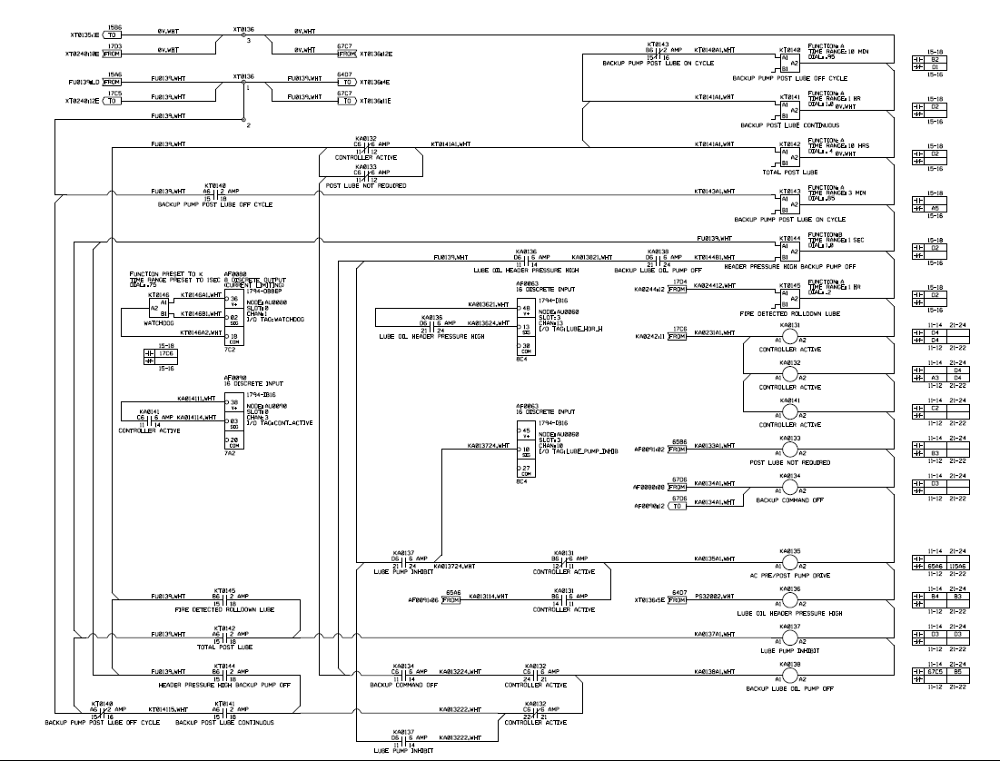
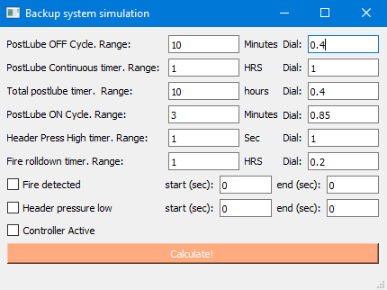
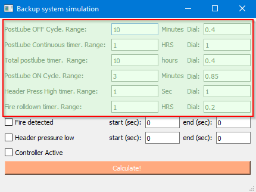
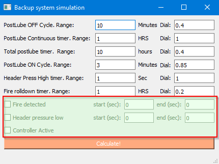
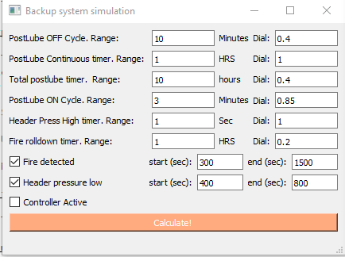
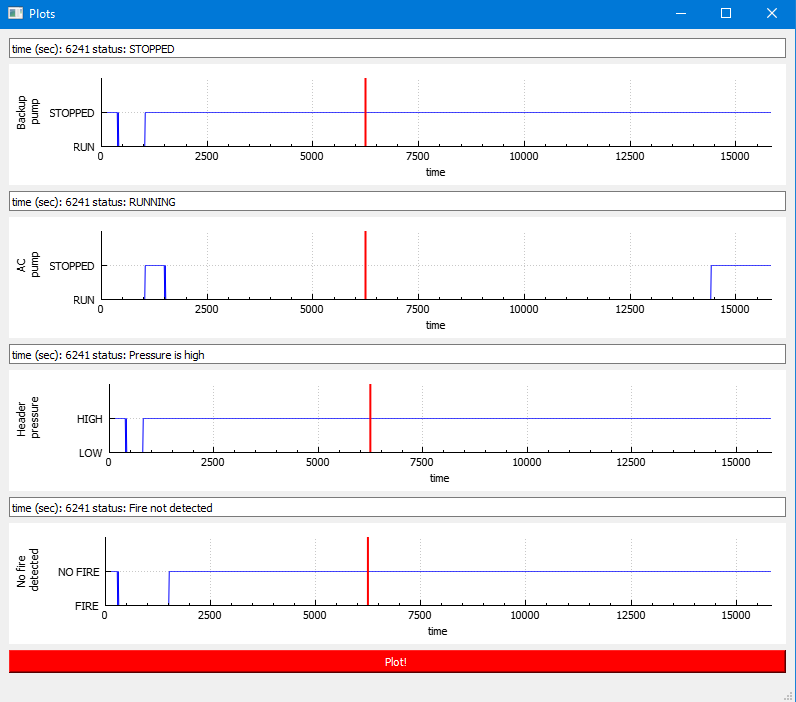
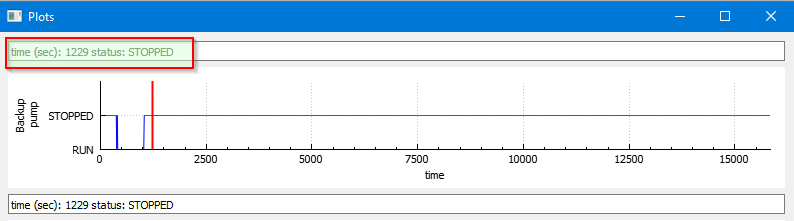

# Backup

[Overview and objective](#overview-and-objective)

[User interface](#user-interface)

## Overview and objective

Gas turbine engine runs hot. After engine shuts down it requires a period of post lubrication. This prevents bearing melting due to accumulated heat.

Normally, a controller would take care of postlube sequence. In case of controller failure relay-based backup system ensures postlube sequence. Controller and backup systems can have different logic of operation.

The main source of information about system operation is electrical schematics which is not easy to read:

The goal was to create an app that would simulate relay system work to allow technicians verify system operation during maintenance or troubleshooting. The program requires user to set up timer presets and configure conditions (if fire detected? is oil pressur low? etc) and also explicity set time (in seconds) when conditions starts and ends. 
After configuration is complete, another window with graphs can be opened and a button should be clicked to calculate result. At this stage a calculation is run for each step (a step corresponds to one second of time). 
The graphs show the complete postlube cycle and allow moving the tracer to see state of each parameter. The tracers in all graphs are synchronized.

Simulation data is stored to structure ResultsData defined in Declarations.h file. In the end of simulation this structure is used to populate plots. QCustomPlot is used to display results

## User Interface
        

Main window allows simulation configuration.

    

Top section is to set time relays.

Set range of each time relay (information is project-specific and is taken from electrical schematics, units are shown to the right of text input box). Value Dial is actual setting of time relay. The value can also be found in the schematics

Below time relay settings is a number of checkboxes to set various conidtions (Fire detected, low oil pressure, Controller Active status). If set, these conditions will only be active within the time range defined by start and end times.

After configuration is complete, hit 'Calculate' button in the bottom of the main window. A new window will open up

To display simulation results, hit 'Plot' button in the bottom of the window. This will display the graphs and tracers. Move tracers with a mouth or with keyboard Right/Left arrows and PgUp/PgDn buttons.
 

Legend shows timestamp and status of each device:

If configuration needs to be updated, close Plot window, change config and hit 'Calculate' button again. New simulation with new data will be loaded.

